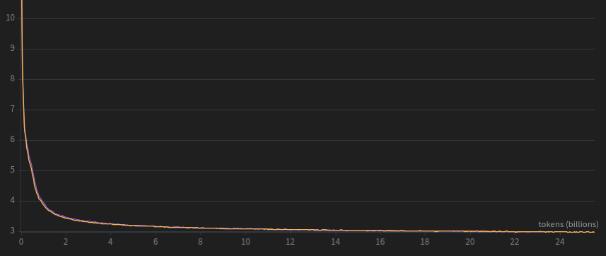
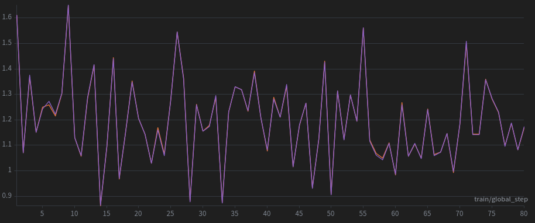
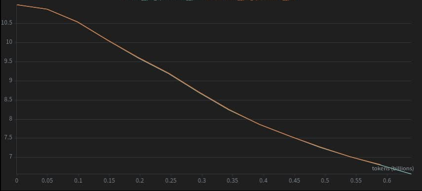

# [Gefen: Optimized Stochastic Optimizer](https://arxiv.org/pdf/2606.13894)

Gefen is a drop-in replacement for the AdamW optimizer (and Muon, see below) for memory-efficient
pre-training. It keeps the familiar AdamW training recipe while dramatically
reducing optimizer-state memory: an 8x reduction in AdamW memory footprint, or
about 6.5 GiB saved per billion parameters, while maintaining AdamW-level
performance. The reduced memory footprint lets you train larger models or use
larger batch sizes and, as a result, achieve higher training throughput.
All it takes is changing two lines of code: import Gefen and replace the AdamW
optimizer constructor. For fine-tuning, we introduce GefenMuon, which does not store second moments (see below).


## Installation


Install from source to get the latest version:

```bash
git clone https://github.com/ndvbd/Gefen
cd Gefen
pip install -e .
```

Or, install from PyPI:

```bash
pip install gefen
```

On the first CUDA run, Gefen builds its fused CUDA kernels with PyTorch JIT and
`nvcc`. This can take a few minutes. Later runs reuse the cached build.

This keeps the source install lightweight, but it requires a CUDA toolkit and
host compiler compatible with your PyTorch installation. In the future, we plan
to make this smoother with prebuilt wheels for common PyTorch/CUDA combinations.

## Quick Start

```python
import torch
from gefen import Gefen

device = "cuda" if torch.cuda.is_available() else "cpu"
model = torch.nn.Linear(128, 10).to(device)

# optimizer = torch.optim.AdamW(
optimizer = Gefen(  # Replace AdamW with Gefen:
    model.parameters(),
    lr=1e-3,
    betas=(0.9, 0.999),
    eps=1e-8,
    weight_decay=0.0,
)

inputs = torch.randn(32, 128, device=device)
targets = torch.randint(0, 10, (32,), device=device)

logits = model(inputs)
loss = torch.nn.functional.cross_entropy(logits, targets)
loss.backward()

optimizer.step()
optimizer.zero_grad(set_to_none=True)

print('Finished successfully.')
```

Pre-training GPT-2 validation loss, Gefen vs. AdamW. Curves are similar:
<p align="center">
  
</p>

## Hugging Face Trainer

Until native `optim="gefen"` support is released in Transformers, pass Gefen to
the Trainer with `optimizer_cls_and_kwargs`:

```python
from gefen import Gefen
from transformers import Trainer, TrainingArguments

training_args = TrainingArguments(
    output_dir="outputs",
    learning_rate=1e-3,
    weight_decay=0.0,
)

trainer = Trainer(
    model=model,
    args=training_args,
    train_dataset=train_dataset,
    optimizer_cls_and_kwargs=(
        Gefen,
        {
            "lr": training_args.learning_rate,
            "betas": (training_args.adam_beta1, training_args.adam_beta2),
            "eps": training_args.adam_epsilon,
            "fused": True,
        },
    ),
)
```

### Distributed Training

Gefen is compatible with standard distributed training setups, including PyTorch DDP, PyTorch FSDP, and flavors of DeepSpeed ZeRO. In the usual DDP, FSDP, and DeepSpeed ZeRO workflows, Gefen can be used like any other PyTorch optimizer. 

### Extension: Gefen-Muon

Based on the Gefen paradigm, a simple extension is to add a pseudo-orthogonalization step on the first moment, as Muon does, while skipping the second moment. This version, which is based on the PyTorch Muon implementation, immediately reduces Muon's optimizer-state footprint by 4x: the first moments are quantized to 8-bit using Gefen's Hessian-block-diagonal-inspired partitioning exact quantization, while performance remains similar to Muon.

You can use it exactly as you use Muon, with a simple constructor name replacement:

```python
from gefen import GefenMuon

optimizer = GefenMuon(
    [muon_parameter for _, muon_parameter in muon_parameter_pairs],
    lr=lr,
)
```

Our experiments show similar performance to Muon, with 4x less persistent optimizer memory (when Muon stores fp32 momentum).
Because Muon supports only 2D parameters, you can either apply the optimizer only to those parameters or use a simple wrapper to flatten all other parameters to 2D.

Below is a training curve of fine-tuning Qwen3-1.7B once with Muon and once with GefenMuon. The curves are similar.
<p align="center">
  
</p>
With GPT2-pretraining, similar loss curves for Muon and GefenMuon
<p align="center">
  
</p>

GefenMuon, supports DDP and FSDP.

## Features
Gefen and GefenMuon support 32-bit and 16-bit training.

Interestingly, Gefen reduces optimizer-step latency because it writes less optimizer-state data to memory.

| Model | AdamW | Gefen |
|:--|--:|--:|
| GPT-2 125M | 11 ms | **3 ms** |
| Llama 3 1.5B | 115 ms | **29 ms** |

## Pretraining versus Fine-tuning
Block-diagonal Hessian structure is stronger in pre-training than in fine-tuning. In fine-tuning, as the name suggests, the Hessian and second-moment structure is flatter and finer in most tensors. Therefore, Gefen should be used for pre-training, and for fine-tuning, we recommend GefenMuon, since it does not store or share a second moment.
Since Gefen infers tensor structure from gradients at the beginning of training, an underlying assumption is that the global batch has a meaningful size, which is most often larger than 1.

## Case Studies and Contribution

In pretraining experiments with a 31.6B-parameter Nemotron-3-style model using NVIDIA Megatron Bridge with full sharding on 8 H100 80 GiB GPUs, Gefen improved throughput by 6x over AdamW: from 25 s/step and 86 tokens/s to 4.2 s/step and 520 tokens/s. AdamW required about 385 GB of CPU offload, while Gefen kept all tensors on GPU and used about 504 GiB of VRAM.

Have you tried Gefen and want to report your impressions privately or publicly?
We would be happy to hear about your experience. The repository is still a work in progress, so with a bit of patience, we will try to address the various intricacies of different frameworks and add more features over time. For suggestions and issues, please contact the main author directly.


## Citation

If you found this library useful, please consider citing our work:

```bibtex
@article{benedek2026gefen,
  title={Gefen: Optimized Stochastic Optimizer},
  author={Benedek, Nadav and Koren, Tomer and Fried, Ohad},
  journal={arXiv preprint arXiv:2606.13894},
  year={2026}
}
```
